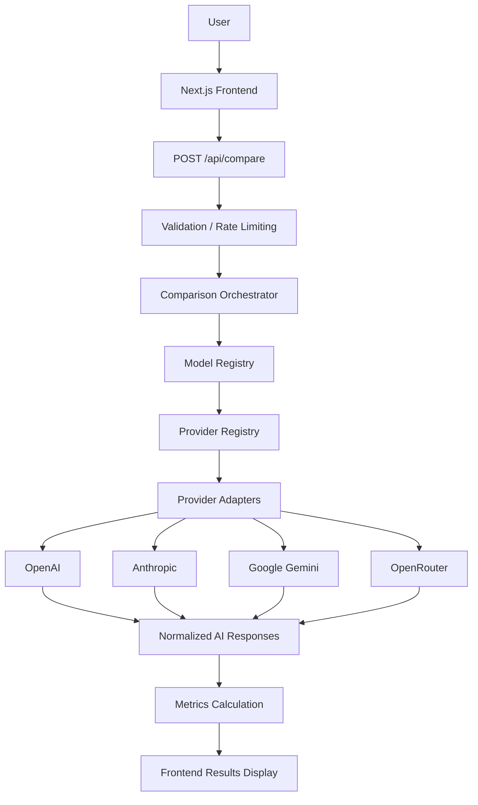

# AI Model Arena

> **Compare foundation AI models side by side.**

AI Model Arena is a full-stack web application designed to compare responses generated by different foundation AI models using the same user prompt.

## Objective

Build a professional AI model comparison platform and a specialized AI-assisted software development environment around the project using Claude Code.

## Key Features

- **Side-by-side AI model comparison**: Compare responses from multiple AI models simultaneously
- **Multiple AI providers**: Support for OpenAI, Anthropic, Google Gemini, and OpenRouter
- **Concurrent provider execution**: Requests execute in parallel for optimal performance
- **Provider failure isolation**: Individual provider failures don't affect successful requests
- **Model catalog/registry**: Centralized, typed model configuration
- **Response metrics**: Latency, token usage, and cost estimation where available
- **Request validation**: Server-side validation of prompts and model selections
- **Weighted rate limiting**: IP-based rate limiting with request cost weighting
- **Security headers**: X-Content-Type-Options, X-Frame-Options, Referrer-Policy
- **Responsive UI**: Mobile-first design with adaptive layouts
- **TypeScript type safety**: Strict typing throughout with branded types

## Technology Stack

- **Frontend**: Next.js 16.2.12, React 19.2.4, TypeScript 5, Tailwind CSS 4
- **Backend**: Next.js App Router, TypeScript
- **AI Providers**:
  - OpenAI (official SDK)
  - Anthropic (official SDK)
  - Google Gemini (official SDK)
  - OpenRouter (gateway to multiple providers)
- **Testing**: Vitest 2.1.9
- **Development**: Node.js, npm, Git, GitHub, Claude Code
- **Deployment**: Vercel

## Current Supported Providers

- **OpenAI**: Via official OpenAI SDK
- **Anthropic**: Via official Anthropic SDK
- **Google Gemini**: Via official Google Generative AI SDK
- **OpenRouter**: Gateway provider supporting numerous models through a single API key

## Architecture



### Architecture Details

1. **Client Layer**: React components for prompt input, model selection, and results display
2. **API Layer**: Next.js route handler (`/api/compare`) with validation and rate limiting
3. **Orchestration Layer**: ComparisonOrchestrator managing parallel execution and error isolation
4. **Registry Layers**: Model and provider registries for dependency resolution
5. **Provider Layer**: Isolated provider adapters implementing AIProvider interface
6. **Normalization Layer**: Standardized AIResponse format with metrics
7. **Presentation Layer**: Responsive UI components displaying results

## Repository Structure

```
ai-model-arena/
│
├── app/
│   ├── api/
│   │   └── compare/
│   │       ├── route.ts          # Comparison API endpoint
│   │       └── __tests__/        # API tests
│   │
│   ├── components/
│   │   ├── PromptInput.tsx       # Prompt input component
│   │   ├── ModelSelector.tsx     # Model selection component
│   │   ├── CompareButton.tsx     # Compare action button
│   │   ├── ComparisonResults.tsx # Results container
│   │   └── ModelResultCard.tsx   # Individual result card
│   │
│   ├── middleware.ts             # Security headers middleware
│   ├── page.tsx                  # Main application page
│   ├── layout.tsx                # Root layout
│   └── globals.css               # Tailwind CSS imports
│
├── lib/
│   └── ai/
│       ├── types.ts              # TypeScript domain models
│       ├── catalog.ts            # Model catalog with metadata
│       ├── registry.ts           # Provider registry
│       ├── orchestrator.ts       # Comparison orchestrator
│       ├── providers/            # Provider implementations
│   │       ├── openai.ts
│   │       ├── anthropic.ts
│   │       ├── google.ts
│   │       └── openrouter.ts
│   │
│   └── __tests__/                # Unit tests
│
├── .claude/
│   ├── skills/                   # Claude Code skills
│   │   ├── ai-provider-integration/
│   │   ├── llm-evaluation/
│   │   ├── ai-security-review/
│   │   ├── ai-app-testing/
│   │   └── architecture-review/
│   │
│   └── commands/                 # Claude Code commands
│       ├── review-architecture.md
│       ├── add-provider.md
│       ├── test-ai-provider.md
│       ├── security-review.md
│       └── project-status.md
│
├── tests/                        # Additional test files
│
├── CLAUDE.md                     # Development rules and guidelines
├── .env.example                  # Environment variables template
├── .gitignore                    # Git ignore rules
├── package.json                  # Dependencies and scripts
├── next.config.ts                # Next.js configuration
├── tsconfig.json                 # TypeScript configuration
└── README.md                     # This file
```

## Requirements

- Node.js >= 20
- npm >= 10
- Git

## Setup Instructions

### Local Development

1. **Clone the repository**
   ```bash
   git clone <repository-url>
   cd ai-model-arena
   ```

2. **Install dependencies**
   ```bash
   npm install
   ```

3. **Configure environment variables**
   ```bash
   cp .env.example .env.local
   ```
   Then edit `.env.local` to add your API keys:
   ```
   # Required for at least one provider
   OPENAI_API_KEY=your_openai_api_key
   ANTHROPIC_API_KEY=your_anthropic_api_key
   GOOGLE_GENERATIVE_AI_API_KEY=your_google_api_key
   OPENROUTER_API_KEY=your_openrouter_api_key
   ```

4. **Start the development server**
   ```bash
   npm run dev
   ```

5. **Access the application**
   Open [http://localhost:3000](http://localhost:3000) in your browser

### Environment Variables

The following environment variables are used by the application:

| Variable | Purpose | Required | Server-Side Only |
|----------|---------|----------|------------------|
| `OPENAI_API_KEY` | Authentication with OpenAI API | No (at least one provider key required) | Yes |
| `ANTHROPIC_API_KEY` | Authentication with Anthropic API | No (at least one provider key required) | Yes |
| `GOOGLE_GENERATIVE_AI_API_KEY` | Authentication with Google Generative AI API | No (at least one provider key required) | Yes |
| `OPENROUTER_API_KEY` | Authentication with OpenRouter API (gateway to multiple providers) | No (at least one provider key required) | Yes |

> **Important**: At least one provider API key must be configured for the application to function. Never commit `.env.local` or expose API keys in client-side code.

## Testing

### Test Commands

- **Full test suite**: `npm test`
- **Linting**: `npm run lint`
- **TypeScript check**: `npx tsc --noEmit`
- **Build**: `npm run build` (note: has known resolution issue)
- **Whitespace check**: `git diff --check`

### Testing Strategy

- **External APIs mocked**: All unit tests mock external AI API calls - no real API calls are made during testing
- **Provider testing**: Each provider has dedicated test suites covering success, error, and edge cases
- **API route testing**: Validation, rate limiting, and error handling tested for `/api/compare` endpoint
- **Unit tests**: Focus on deterministic behavior, response normalization, and error isolation
- **Test fixtures**: Located alongside source files and in `__mocks__/` directory

### Known Build Issue

The project has a pre-existing Next.js/Turbopack resolution issue:
```
Module not found: Can't resolve 'next/server'
```

This issue has been investigated and confirmed to exist in the original/pre-existing codebase. It is unrelated to any changes made during PHASEs 9B-13 and does not affect runtime functionality in development mode (`npm run dev`). The issue is currently treated as a known limitation of the Next.js version used.

## Security

### Implemented Security Measures

- **Server-side API keys**: All API keys stored in environment variables, never exposed to client
- **Request validation**: Server-side validation of prompt length (max 10,000 chars) and model IDs
- **Model validation**: All model IDs verified against internal catalog before processing
- **Weighted IP-based rate limiting**: Requests weighted by model count (1 model = 1 cost, 2 models = 2 cost, etc.)
- **Rate limiter cleanup**: Automatic cleanup of expired entries to prevent memory growth
- **Security headers**:
  - `X-Content-Type-Options: nosniff`
  - `X-Frame-Options: DENY`
  - `Referrer-Policy: strict-origin-when-cross-origin`
- **Provider failure isolation**: Individual provider errors don't affect successful requests
- **No secret exposure**: Stack traces and provider-specific errors are sanitized before returning to client
- **Input sanitization**: While not performing HTML sanitization (as content is displayed as text), all inputs are validated for type and length

### Security Limitations

- **Rate limiter IP tracking**: No upper bound on tracked IPs (potential exhaustion vector)
- **Request size limiting**: No explicit limit on request body size beyond JSON parsing
- **Advanced abuse prevention**: No CAPTCHA, authentication, or behavioral analysis

## Deployment

### Vercel Deployment Process

1. **Push to GitHub**: Ensure your main branch is pushed to GitHub
2. **Import project**: In Vercel dashboard, import the GitHub repository
3. **Configure environment variables**: Add the same API keys from `.env.local` to Vercel project settings
4. **Deploy**: Vercel will automatically build and deploy the application
5. **Verify**: Check that the deployment succeeds and the application is accessible

### Important Notes

- **Never commit `.env.local`**: Add to `.gitignore` (already configured)
- **Build issue acknowledgment**: The known `next/server` resolution issue may affect production builds
- **Development vs Production**: Application functions correctly in development mode (`npm run dev`)
- **Environment variables**: Must be configured in both local development and Vercel environments

## Development Workflow

### Claude Code System

This project includes a specialized Claude Code development environment:

- **CLAUDE.md**: Permanent rules for development (architecture, security, testing guidelines)
- **.claude/skills/**: Specialized development knowledge:
  - `ai-provider-integration/]: Adding and maintaining AI providers
  - `llm-evaluation/`: Future LLM evaluation functionality
  - `ai-security-review/`: AI-specific security review
  - `ai-app-testing/`: AI application testing strategies
  - `architecture-review/`: Architecture review workflows
- **.claude/commands/**: Reusable developer workflows:
  - `/review-architecture`: Complete architecture audit
  - `/add-provider`: Add a new AI provider
  - `/test-ai-provider`: Test a provider integration
  - `/security-review`: AI-specific security review
  - `/project-status`: Project health snapshot

### Standard Development Process

1. **Inspect**: Review existing implementation and CLAUDE.md guidelines
2. **Plan**: For non-trivial changes, use EnterPlanMode to design approach
3. **Implement**: Make smallest maintainable change following existing patterns
4. **Validate**: Run relevant tests (`npm test`), lint (`npm run lint`), and check build when appropriate
5. **Document**: Update documentation as needed
6. **Review**: For significant changes, consider using appropriate `/command`

## Project Phase Status

Based on AI_MODEL_ARENA_PROJECT.md and git history:

- **PHASE 0 — Repository and Environment Inspection**: completed
- **PHASE 1 — Project Initialization**: completed
- **PHASE 2 — Types and Architecture**: completed
- **PHASE 3 — Provider Abstraction**: completed
- **PHASE 4 — OpenAI**: completed
- **PHASE 5 — Comparison API**: completed
- **PHASE 6 — Frontend MVP**: completed
- **PHASE 7 — Anthropic and Google**: completed
- **PHASE 8 — Metrics**: completed
- **PHASE 9 — Security**: completed
- **PHASE 10 — Testing**: completed
- **PHASE 11 — UI Polish**: completed
- **PHASE 12 — Architecture Review**: completed
- **PHASE 13 — Documentation**: current
- **PHASE 14 — Production Readiness**: upcoming
- **PHASE 15 — Vercel Deployment Preparation**: upcoming

## Architecture Review Findings

From PHASE 12 architecture review, the following considerations were identified for future improvement:

- **Rate limiter enhancement**: Add maximum IP tracking limit to prevent exhaustion attacks
- **Configuration validation**: Implement startup validation for required environment variables
- **Standardized error handling**: Create unified error handling utility for providers
- **Request size limiting**: Add protection against large payload attacks
- **Request tracing**: Consider adding request IDs for debugging and monitoring
- **UI state improvements**: Potential for more granular loading states (per-model vs global)

These are labeled as **future improvements** - not current architectural failures. The core architecture is sound and follows best practices.

## Roadmap

### Completed
- Project initialization and setup
- Type-safe domain modeling
- Provider abstraction layer
- OpenAI, Anthropic, Google Gemini integrations
- Comparison API with validation and rate limiting
- Frontend MVP with responsive UI
- Metrics (latency, token usage, cost estimation)
- Security implementation (headers, validation, isolation)
- Comprehensive test suite
- UI polish and accessibility improvements
- Architecture review

### Current
- **PHASE 13 — Documentation**: Updating README.md and related documentation

### Future
- **PHASE 14 — Production Readiness**: Final testing, linting, and build validation
- **PHASE 15 — Vercel Deployment Preparation**: Deployment documentation and verification
- **Post-MVP**: Based on AI_MODEL_ARENA_PROJECT.md:
  - LLM evaluation functionality (AI-as-a-Judge, automated scoring)
  - User accounts and comparison history
  - Prompt library and templates
  - RAG (document uploads, embeddings, retrieval)
  - Public benchmarking and community features

## License

No license file is present in the repository. Please check with project maintainers for licensing information.

---
*Built with Claude Code*